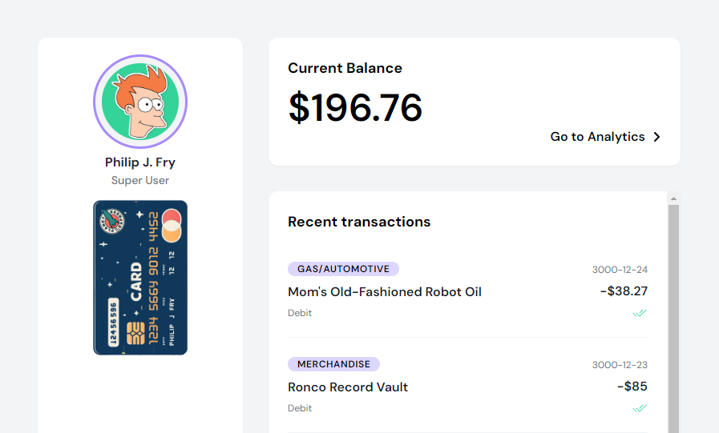

<!-- PROJECT -->

<a id="readme-top"></a>

<div align="center">
 

  <h3 align="center">Fake Bank</h3>

  <p align="center">
    A personal project made starting from an exercise during the Frontend - Coding Bootcamp at Edgemony.
  </p>
</div>

<!-- TABLE OF CONTENTS -->
<details>
  <summary>Table of Contents</summary>
  <ol>
    <li>
      <a href="#about-the-project">About The Project</a>
      <ul>
        <li>
            <a href="#built-with">Built With</a>
        </li>
        <li>
            <a href="#system-architecture">System Architecture</a>
        </li>
        <li>
            <a href="#pages">Pages</a>
        </li>
        <li>
            <a href="#actions">Actions</a>
        </li>
        <li>
            <a href="#data-models">Data Models</a>
        </li>
        <li>
            <a href="#context-provider">Context Provider</a>
        </li>
      </ul>
    </li>
    <li>
        <a href="#getting-started">Getting Started</a>
    </li>
    <li>
        <a href="#contacts">Contacts</a>
    </li>
    <li>
        <a href="#license">License</a>
    </li>
    <li>
        <a href="#note">Note</a>
    </li>
  </ol>
</details>

<!-- ABOUT THE PROJECT -->

## About The Project

The project is designed to simulate a fake bank account for Philip J. Fry from the animated TV series Futurama.

### Built With

<!-- CREDITS -->

<div style="display: flex; align-items: center; gap: 0.5rem">
  
	
	
    <span style="display: inline-flex; align-items: center; gap: 0.2rem; font-family: Arial; font-size: 0.8rem; font-weight: bold; background-color: white; color: red; padding: 0.1rem 0.3rem; border-radius: 0.2rem;">mongoose</span>
	
	
    <span style="display: inline-flex; align-items: center; gap: 0.2rem; font-family: Arial; font-size: 0.8rem; background-color: #169BFF; color: white; padding: 0.1rem 0.3rem; border-radius: 0.2rem;">ApexCharts</span>
    
</div>

### System Architecture

The project is are organized into the following directories:

- `action`: contains a set of functions that perform specific actions related to the application's data.
- `app`: contains the main application code, including pages, components, and providers.
  - `api`: contains API routes for interacting with the fake bank database.
  - `components`: contains reusable React components used throughout the application.
  - `models`: contains data models for the fake bank database.
  - `providers`: contains context providers for managing application state.
- `public`: contains static assets, such as images.

<p align="right">(<a href="#readme-top">back to top</a>)</p>

### Pages

- `[app/(routes)/page.tsx]`: the main login page, which displays a logo, email, and password fields, and a login button.
- `[app/(routes)/layout.tsx]`: the page that serves as the top-level layout for the entire application, providing a basic structure for the app's content. It is responsible for rendering the HTML document, body, and main content area, and provides a container for the `Aside` component and the `TransactionsProvider` component.
- `[app/(routes)/loading.tsx]`: a page displayed when a requested resource is loading.
- `[app/(routes)/not-found.tsx]`: a page displayed when a requested resource is not found.
- `[app/(routes)/dashboard/page.tsx]`: a dashboard page that displays the balance and recent transactions.
- `[app/(routes)/transactions/page.tsx]`: a page that displays a table of transactions.
- `[app/(routes)/analytics/page.tsx]`: a page that displays charts and graphs for analyzing transaction data.
- `[app/(routes)/savings/page.tsx]`: a page that displays savings account information.

<p align="right">(<a href="#readme-top">back to top</a>)</p>

### Actions

The `[action]` folder is a directory that contains a set of functions that perform specific actions related to the application's data. These functions are used to interact with the database, fetch data, and update the application's state. The response data from the function gets parsed as JSON, or throws an error if the request fails.

- `get-categories`: fetches all categories from the database. It uses the `fetch API` to make a `GET request` to the` /api/transactions/categories endpoint`.
- `get-types`: fetches all types from the database. It uses the `fetch API` to make a `GET request` to the `/api/transactions/types endpoint`.
- `get-transactions`: fetches all transactions from the database. It uses the `fetch API` to make a `GET request` to the `/api/transactions endpoint`.
- `post-transaction`: creates a new transaction in the database. It uses the `fetch API` to make a `POST request` to the `/api/transactions endpoint`, and sends the transaction data in the request body.

<p align="right">(<a href="#readme-top">back to top</a>)</p>

### Data Models

The application uses MongoDB for the fake bank database. The models used throughout the application to interact with the database are defined in the models directory.

#### Transaction Model

The most important model represents a single transaction in the database. It has the following properties:

- `_id`: a unique identifier for the transaction
- `transactionDate`: the date of the transaction
- `description`: a brief description of the transaction
- `category`: the category of the transaction ("Food", "Entertainment", etc.)
- `amount`: the amount of the transaction
- `type`: the type of transaction ("debit", "credit", "income".)

#### Data Schema

The data schema for the application is defined using `Mongoose`, a popular `MongoDB` ORM for Node.js. The schema defines the structure of the data in the database and provides a way to interact with the data using a simple and intuitive API.

#### Data Storage

The application uses a MongoDB database to store data. The database is connected to the application using the `mongoose` library, which provides a simple and intuitive API for interacting with the database.

#### Data Retrieval

The application uses API routes to retrieve data from the database. The API routes are defined in the api directory and provide a way to retrieve data from the database using a simple and intuitive API.

- `GET /api/transactions`: returns a list of transactions.
- `GET /api/transactions/categories`: returns a list of transaction categories.
- `GET /api/transactions/types`: returns a list of transaction types.

<p align="right">(<a href="#readme-top">back to top</a>)</p>

### Context Provider

The `[TransactionsContext (app/providers/TransactionsContext.ts)]` is a context provider that manages the state of the transactions in the application. It is responsible for fetching transactions from the database, updating the transactions state, and providing the transactions data to the components that need it.

- The `[TransactionsProvider]` is a React context provider that manages the state of the transactions in the application. It uses the `useState` hook to initialize the state of the transactions, expenses, income, savings, balance amount, and savings amount.

- The `[fetchTransactions]` function is used to fetch transactions from the database using the `getTransactions` action. The `[refetchTransactions]` function is used to refetch the transactions when the component is re-rendered.

- The `useEffect` hook is used to fetch the transactions when the component is mounted.

- The `TransactionsContext.Provider` component is used to provide the transactions data to the components that need it. The `value` prop is used to pass the transactions data to the provider.

<p align="right">(<a href="#readme-top">back to top</a>)</p>

<!-- GETTING STARTED -->

## Getting Started

To get a local copy up and running follow these steps.

### Prerequisites

- Node.js (version 14 or higher)
- npm (version 6 or higher)
- A code editor or IDE of your choice

### Cloning the Repository

1. Open a terminal or command prompt and navigate to the directory where you want to clone the repository.
2. Run the following command to clone the repository:
   ```sh
   git clone https://github.com/majinbrum/fake-bank.git
   ```

### Installing Dependencies

1. Navigate to the cloned repository directory:
   ```sh
   cd fake-bank
   ```
2. Run the following command to install the dependencies (this may take a few minutes to complete):
   ```sh
    npm install
   ```

### Setting up the Environment

1. Create a new file named `.env` in the root directory of the project.
2. Add the following environment variable to the `.env` file:
   ```sh
    MONGODB_URI=...
   ```
   Replace the `MONGODB_URI` with your actual MongoDB connection string.

### Starting the Application

1. Run the following command to start the application:
   ```sh
    npm run dev
   ```
   This will start the development server and make the application available at `http://localhost:3000`.

<p align="right">(<a href="#readme-top">back to top</a>)</p>

<!-- CONTACTS -->

## Contacts

**Bruna Alamia** **-** [@linkedin](https://linkedin.com/in/brunaalamia) **-** brunaalamia@gmail.com

<p align="right">(<a href="#readme-top">back to top</a>)</p>

<!-- LICENSE -->

## License

This project is licensed under the MIT License.

<p>Copyright (c) 2024 Bruna Alamia

Permission is hereby granted, free of charge, to any person
obtaining a copy of this software and associated documentation
files (the "Software"), to deal in the Software without
restriction, including without limitation the rights to use,
copy, modify, merge, publish, distribute, sublicense, and/or sell
copies of the Software, and to permit persons to whom the
Software is furnished to do so, subject to the following
conditions:

The above copyright notice and this permission notice shall be
included in all copies or substantial portions of the Software.

THE SOFTWARE IS PROVIDED "AS IS", WITHOUT WARRANTY OF ANY KIND,
EXPRESS OR IMPLIED, INCLUDING BUT NOT LIMITED TO THE WARRANTIES
OF MERCHANTABILITY, FITNESS FOR A PARTICULAR PURPOSE AND
NONINFRINGEMENT. IN NO EVENT SHALL THE AUTHORS OR COPYRIGHT
HOLDERS BE LIABLE FOR ANY CLAIM, DAMAGES OR OTHER LIABILITY,
WHETHER IN AN ACTION OF CONTRACT, TORT OR OTHERWISE, ARISING
FROM, OUT OF OR IN CONNECTION WITH THE SOFTWARE OR THE USE OR
OTHER DEALINGS IN THE SOFTWARE.</p>

## Note

This project focus wasn't style, so it lacks of mobile compatibility. It could be a future improvement.
